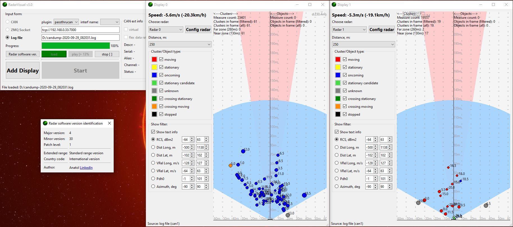

## About RadarVisual
**RadarVisual** is a open project for working with radar [**Continental ARS 408-21**](https://conti-engineering.com/components/ars-408/) (visualization and configuration)

### Features:
* Ability to get data in 3 ways:
  * via PEAK-CAN (USB)
  * via .log file
  * via ZMQ
* Ability to use up to 8 radars simultaneously
* Configuration:
  * Radar state configuration 
  * Filters configuration (cluster, objects)
  * Collisions configuration 
* Calculates vehicle velocity (if radar is moving)
* Write CAN data to .log file

### Supported OS
  * Windows
  * Ubuntu

### P.S.
* For using ZMQ you have to have the installed ZMQ-library (tested with 4.3.0 version [libZmq](https://github.com/zeromq/libzmq/releases/tag/v4.3.0) + [cppZmq](https://github.com/zeromq/cppzmq/releases/tag/v4.3.0))
* Project not tested with other models of radars
* __Important!__ Project may contain some issues or bugs. Current software is free, so author is not responsible for the use of the software

### Few links:
  * [**PEAK-Drivers**](https://www.peak-system.com/Drivers.523.0.html?&L=1)
  * [**How it works**](https://www.youtube.com/watch?v=mCstMJNNWWk)
  * [**Author=)**](https://www.linkedin.com/in/anatol-trush-1703b0133/)